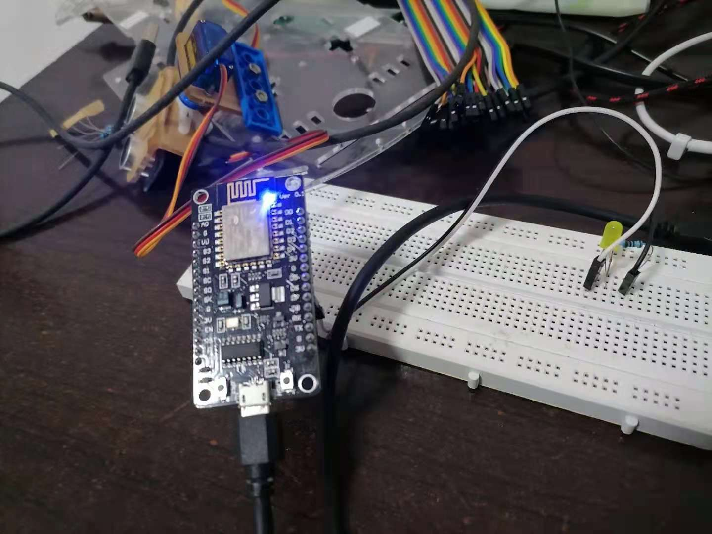
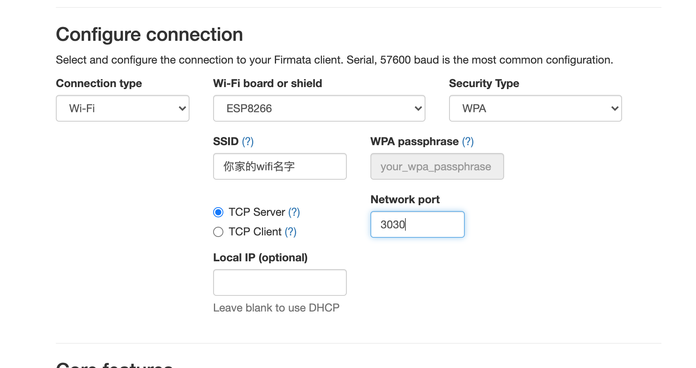
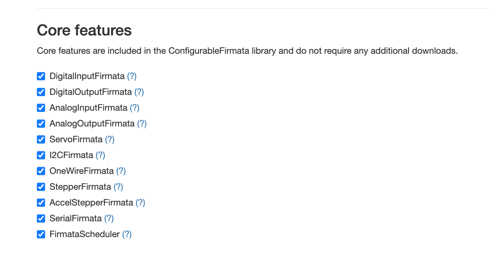
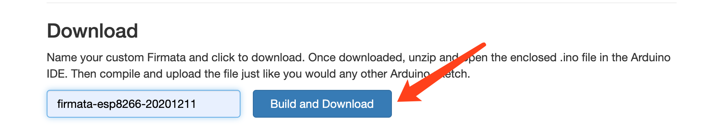
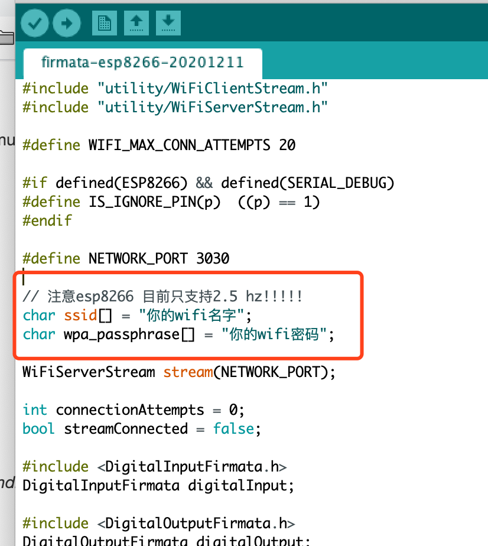

# golang（开发语言） + esp8266（开发版） + gobot（框架）

## 准备

> 硬件

- esp8266（开发版）
- 数据线
- led 灯
- 电阻
- 线
- 面包屑

> 软件

- goalng （语言）
- MQTT（服务器）
- Arduino (IDE)
- Vscode (IDE)
- gobot (框架)
- Firmata （框架）

## 开发

> 1.Arduino 安装 esp8266 开发版

        1.在附加开发版上添加 json http://arduino.esp8266.com/stable/package_esp8266com_index.json

> 2.esp8266 连线

        led + 电阻 + esp8266



> 3.上传 demo（示列） 程序--不是新手可以忽略

如果正常，esp8266 蓝色灯会闪烁

```c++
void setup() {
  pinMode(LED_BUILTIN, OUTPUT);
}
void loop() {
  digitalWrite(LED_BUILTIN, HIGH);   // turn the LED on (HIGH is the voltage level)
  delay(1000);                       // wait for a second
  digitalWrite(LED_BUILTIN, LOW);    // turn the LED off by making the voltage LOW
  delay(1000);                       // wait for a second
}
```

> 4.搭建 MQTT（协议） 服务器

[太极创客的 MQTT 服务器](http://www.taichi-maker.com/public-mqtt-broker/)

> 5.下载支持 Wifi 的固件

- 进入网站 http://firmatabuilder.com/






- 解压，使用 Arduino 打开 下载的文件
- 修改自己的 WIFI 信息
- 上传文件到 ESP8266
- 如果一切正常，在串口监视器查看信息

> 6. 使用 gobot 开发

```golang
package main

import (
	"fmt"
	"time"

	"gobot.io/x/gobot"
	"gobot.io/x/gobot/drivers/gpio"
	"gobot.io/x/gobot/platforms/firmata"
	"gobot.io/x/gobot/platforms/mqtt"
)

// MQTT 服务器信息
const (
	Host     = "tcp://test.ranye-iot.net:1883"
	UserName = ""
	Password = ""
)

func main() {
	// mqtt 设置ping消息
	mqttAdaptor := mqtt.NewAdaptor(Host, "pinger")
	// ESP8266 的地址
	firmataAdaptor := firmata.NewTCPAdaptor("192.168.1.43:3030")
	// ESP8266 端口
	led := gpio.NewLedDriver(firmataAdaptor, "13")

	work := func() {
		// 监听 MQTT 消息
		mqttAdaptor.On("msg", func(msg mqtt.Message) {
			// 获取 消息
			msgs := msg.Payload()
			b := string(msgs)

			fmt.Println(b)
			if b == "1" {
				// led打开
				led.On()
			} else {
				// 关闭
				led.Off()
			}

		})

		// 发布消息
		data := []byte("o")
		gobot.Every(2*time.Second, func() {
			mqttAdaptor.Publish("hello", data)
		})
	}

	robot := gobot.NewRobot("mqttBot",
		[]gobot.Connection{mqttAdaptor, firmataAdaptor},
		[]gobot.Device{led},
		work,
	)

	robot.Start()
}


```

> 7. 编译，启动

```bash
go build
```

## 总结
