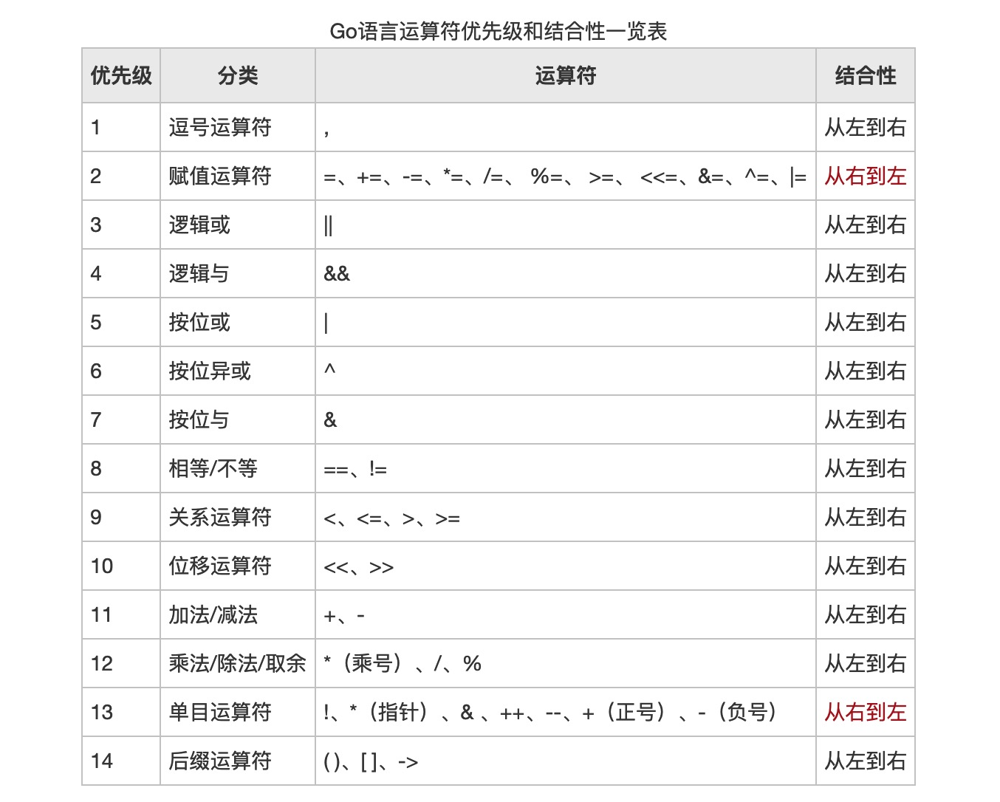

# go 学习笔记

## 目录

- [安装和搭建-golang-开发环境](#安装和搭建-golang-开发环境)
- [关键字](#关键字)
- [变量](#变量-var-const)
- [算术运算](#算术运算)
- [Go-函数](#Go-函数)
- [Go 指针](#Go指针)
- [Array 数组](#Array数组)
- [Slice 切片](#Slice切片)
- [Struct](#Struct构造体)
- [Type 自定义类型](#Type自定义类型)
- [GoJson](#GoJson)
- [GoMap](#GoMap)
- [Go 并发](#Go并发)
- [Go 打印控制台](#Go打印控制台)
- [Go 基础命令](#Go基础命令)

- [GO 实际使用中的注意事项及问题](#Go实际使用中的注意事项及问题)

## 优秀的文章及教程

- [李文周-点击我查看详细文档](https://www.liwenzhou.com/posts/Go/go_menu/)
- [apiServer-教程](http://47.104.107.180/category/Go)

## 安装和搭建-golang-开发环境

> Mac 安装

```bash
brew install go
```

> Linux 安装

```bash
sudo apt-get install golang
# 或
yum install golang
```

## 关键字

- 25 关键字

  |          |             |        |           |        |
  | :------: | :---------: | :----: | :-------: | :----: |
  |  break   |   default   |  func  | interface | select |
  |   case   |    defer    |   go   |    map    | struct |
  |   chan   |    else     |  goto  |  package  | switch |
  |  const   | fallthrough |   if   |   range   |  type  |
  | continue |     for     | import |  return   |  var   |

- 36 预定义标识符

## 变量-var-const

> 声明规范

    字母和下划线开头,推荐驼峰命名，变量名尽量让人看的懂

> 变量 var

```go
package main
import (
	"fmt"
)
func main()  {
	var flag bool = false // 布尔类型
	// 注意：浮点32 和浮点64 类型不一样，必须转换后，才能参与计算
	var price32 float32 = 99.00 // 浮点类型 32
	var price64 float64 = 100.12 // 浮点类型 64
	var price64s = float64(price32)

	var aname byte = 'a' // 字符类型,只能写一个，不然会报错
	// 输出的ascll 码  97
	fmt.Println(aname)
	var name string = "张德帅" // 字符串
	var age int = 18
}
```

> 常量 const

    常量不能改变,必须初始化

```go
const name = "张德帅"
```

## 算术运算

    类型转换, 注意：
    int 转 float 强制转换， 多小数
    float 转int 强制转换， 丢精度



## Go-函数

## Go 指针

## Array 数组

## Slice 切片

## Struct 构造体

## Type 自定义类型

## GoJson

## GoMap

## Go 并发

## Go 基础命令

## Go 实际使用中的注意事项及问题
