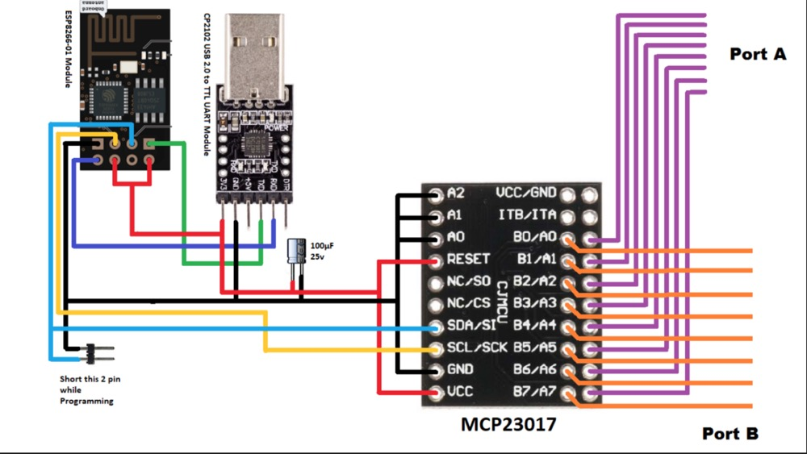

```c++
#include "Wire.h"

void setup() {
  Wire.begin(0,2);                  //ESP-01
  Wire.beginTransmission(0x20);     // MCP23017 Address
  Wire.write(0x00);                 // IODIRA register
  Wire.write(0x00);                 // set all port A to output
  Wire.endTransmission();

  Wire.beginTransmission(0x20);     // MCP23017 Address
  Wire.write(0x01);                 // IODIRB register
  Wire.write(0x00);                 // set all port B to output
  Wire.endTransmission();
}

// Function for Port A LED ON/OFF
void ledBlinkPortA(byte a)
{
  Wire.beginTransmission(0x20);
  Wire.write(0x12);                 // address bank A
  Wire.write(a);
  Wire.endTransmission();
  delay(100);
}

// Function for Port B LED ON/OFF
void ledBlinkPortB(byte a)
{
  Wire.beginTransmission(0x20);
  Wire.write(0x13);                 // address bank B
  Wire.write(a);
  Wire.endTransmission();
  delay(100);
}

void loop() {
  ledBlinkPortA((byte)0xfe);        // LED1 ON
  ledBlinkPortA((byte)0xfd);        // LED2 ON
  ledBlinkPortA((byte)0xfb);        // LED3 ON
  ledBlinkPortA((byte)0xf7);        // LED4 ON
  ledBlinkPortA((byte)0xef);        // LED5 ON
  ledBlinkPortA((byte)0xdf);        // LED6 ON
  ledBlinkPortA((byte)0xbf);        // LED7 ON
  ledBlinkPortA((byte)0x7f);        // LED8 ON
  
  ledBlinkPortB((byte)0xfe);        // LED9 ON
  ledBlinkPortB((byte)0xfd);        // LED10 ON
  ledBlinkPortB((byte)0xfb);        // LED11 ON
  ledBlinkPortB((byte)0xf7);        // LED12 ON
  ledBlinkPortB((byte)0xef);        // LED13 ON
  ledBlinkPortB((byte)0xdf);        // LED14 ON
  ledBlinkPortB((byte)0xbf);        // LED15 ON
  ledBlinkPortB((byte)0x7f);        // LED16 ON
}
```