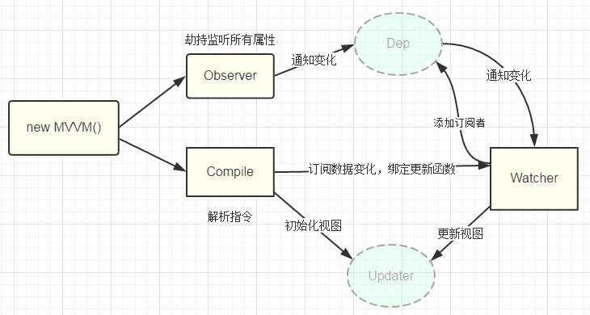

# 前端面试题

## Vue

### Vue 数据双向绑定原理

- 劫持监听所有属性 Observer 👉 通知 Dep-得普 通知 👉 Watcher-瓦切儿 （反向-向 Dep-得普 添加订阅者）

- 解析指令 Compile-康派儿 订阅数据变化，绑定更新函数 👉 Watcher-瓦切儿

  👇
  初始化视图

  👇
  Updater



### Vue 生命周期

- beforeCreate (组件实例刚被创建，组件属性计算之前，如 data 属性等)
- created (组件实例创建完成， 属性已绑定，但 DOM 还未生成, \$el 属性不存在)
- beforeMount-比佛毛特儿 (模版编译/挂载之前)
- mounted-某儿得 (模版编译/挂载之后-不保证组件已在 document 中)
- beforeUpdate (组件更新之前)
- updated (组件更新之后)
- activated (for keep-alive 组件被激活时被调用)
- deactivated-滴阿克味得 (for keep-alive 组件被移除时调用)
- deforeDestory-滴佛丝得瑞 (组件销毁前调用)
- destoryed-滴丝尊儿 (组件销毁后调用)

### Vue 钩子函数

- methods-马甚丝 (对象中定义方法)
- computed (计算属性)

### Vue 组件通信

> 父组件和子组件通信

- props-破软丝 (传值)
- ref-瑞府 （调用子组件的方法）

```js
// 子组件
<div>
  <p class="title">{{ title }}</p>
</div>
export default {
  props: {
    title: {
      type: String,
      default: "",
    },
  },
  methods:{
      show(data){
          console.log('----', data)
      },
  }
};
// 父组件
<MenuNav :title="title" ref="MenuNav"</MenuNav>
<p @click="show">显示</p>
import MenuNav from "@components/MenuNav/MenuNav.vue";
export default {
    data(){
        return{
            title:"这是父组件得值"
        }
    },
    methods:{
        show(){
            this.$refs.MenuNav.show('id')
        }
    }

}
```

> 子组件和父组件通信

- props-破软丝
- \$parent-佩润特
- \$emit 是手动触发当前实例上的一个指定事件。
- \$on 是用来在监听(注册)自定义事件的。

```js
// 父组件
<MenuNav :parentHide="parentHide" @getParent3="getParent3"></MenuNav>
import MenuNav from "@components/MenuNav/MenuNav.vue";
export default {
    data(){
        return{
            title:""
        }
    },
    methods:{
        parentShow(){
            console.log('-----父组件的方法1')
        },
        parentHide(){
            console.log('------父组件的方法2')
        },
        getParent3(data){
            console.log("------这是父组件的方法3", data);
        }
    }

}

// 子组件
<div>
  <p class="title"></p>
  <button @click="show"></button>
  <button @click="hide"></button>
  <button @click="getParent3">调用父组件的方法3</button>
</div>
export default {
  props: {
    parentHide: {
      type: Function,
      default: ()=>{},
    },
  },
  methods:{
      show(){
         this.$parent.parentShow()
      },
      hide(){
          this.parentHide()
      },
      getParent3() {
          this.$emit("getParent3", "这是子组件的值");
      },
  }
};

```

> 不相干的组件

使用 vuex

### Vuex 使用

> 第一步在 store 增加方法

```js
import Vue from "vue";
import Vuex from "vuex";

Vue.use(Vuex);

export default new Vuex.Store({
  state: {
    name: "默认名字",
  },
  // 格的儿丝
  getters: {
    name: (state) => state.name,
  },
  // 莫特甚丝
  mutations: {
    setName(state, data) {
      state.name = data;
    },
  },
  actions: {
    changeName({ commit }, data) {
      commit("setName", data);
    },
  },
  modules: {},
});
```

> 第二步 在需要改变的地方监听

```js
import { mapGetters } from "vuex";
// computed 是计算属性，只要有值改变就会触发
computed: {
  ...mapGetters({
    name: "name",
  }),
},
```

> 第三步调用

```js
<button @click="changeStoreName">改变name</button>

changeStoreName() {
  // dispatch-得丝败切
  this.$store.dispatch("changeName", "通过vue传");
},
```

### \$nextTick 原理

对于 MVVM 框架结构的技术栈是不推荐操作 DOM 的，但是很多情况下可能会需要操作 DOM，特别是一些 charts 插件等

- 先判断 Promise
- 在判断 MutationObserver
- 在判断 setImmediate
- 最后 setTimeout

### keep-alive

- keep-alive 是 Vue 内置的一个组件，可以使被包含的组件保留状态，避免重新渲染
  一般结合路由和动态组件一起使用，用于缓存组件；
- 提供 include 和 exclude 属性，两者都支持字符串或正则表达式， include 表示只有名称匹配的组件会被缓存，exclude 表示任何名称匹配的组件都不会被缓存 ，其中 exclude 的优先级比 include 高；

- 对应两个钩子函数 activated 和 deactivated ，当组件被激活时，触发钩子函数 activated，当组件被移除时，触发钩子函数 deactivated

### computed watch props

## 其他面试题

- 1、vue 组件 data 为什么必须是函数； 不 ok
  首先我们知道 vue 组件最大的特性是可复用，当我们的 data 是一个函数的时候，每一个实例的 data 属性都是独立的，不会相互影响了
- 2、v-if 和 v-for 那个优先级更高；不 ok
  v_for 高，要避免出现这种情况，则在外层嵌套 template，在这一层进行 v-if 判断，然后在内部进行 v-for 循环
- 3、你了解哪些 vue 的性能调优；不 ok
  组件复用，提取公用组件，环境的配置利用 process.env.NODE_ENV 配置参数对生产环境，正式环境进行优化，对 for 循环加个判断，接口数据拆分等 cdn 等
- 5、vue 中的 computed 和 watch 的区别 ok
  computed 计算属性，在 computed 里面被缓存，每当其中一个或多个被改变时，会重新计算其属性值，watch 属性监听
- 6、谈谈 \$nextTick 的原理 不 ok
  对于 MVVM 框架结构的技术栈是不推荐操作 DOM 的，但是很多情况下可能会需要操作 DOM，特别是一些 charts 插件等
  先判断 Promise
  在判断 MutationObserver
  在判断 setImmediate
  最后 setTimeout
- 9、[] == ![] 类型转换 不 ok
  空数组会转化成数字类型去比较;
- 10、eventLoop 没听过
  Event Loop 即事件循环，是指浏览器或 Node 的一种解决 javaScript 单线程运行时不会阻塞的一种机制，也就是我们经常使用异步的原理。
- 11、const let var 不 ok
- 12、vue 中 key 的作用和工作原理 不 ok
  vue 为了节约性能，对 dom 进行了复用，对比 dom 中各个节点，替换掉一些属性，同时又保留一些东西 diff
