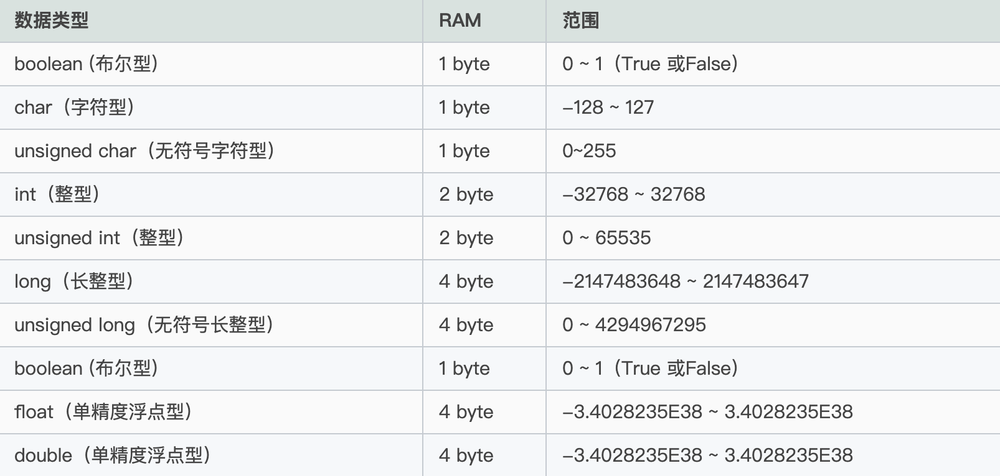

# c++学习笔记

## 目录

- [安装编译器](#安装编译器)
- [编写第一个-c++程序](#编写第一个-c++程序)
- [c++数据类型](#c++数据类型)
- [using-namespace-命令空间](#using-namespace-命令空间)
- [c++输入输出库](#c++输入输出库)
- [new-和-delete-操作符](#new-和-delete-操作符)
- [函数](#函数)
- [c++类和对象](#c++类和对象)
- [c++流程控制](#c++流程控制)


## 安装编译器

> Linux

```bash
# 查看编译器安装
$ g++ -v
```

> Windows ？

## 编写第一个-c++程序

> 创建文件 .cpp

```c++
// 创建一个文件xx.cpp
#include <iostream>

int main()
{
std::cout << "Hello World!\n";
return 0;
}
```

> 编译.cpp

```bash
# -o 的意思是编译可执行文件
g++ main.cpp -o main
```

## c++数据类型



## using-namespace-命令空间

        备注:防止命令冲突

```c++
#include <iostream>
void func(){
    //必须重新声明
    using namespace std;
    cout<<"张德帅"<<endl;
}
int main(){
    //声明命名空间std
    using namespace std;

    cout<<"---"<<endl;
    func();
    return 0;
}
```

## c++输入输出库

> cin(输入) cout(输出) endl(换行)

```c++
// 使用命名空间
#include <iostream>
#include <string>
using namespace std;
int main()
{
    string name;
    int age;
    string sex;
    // 获取用户输入
    cin >> name >> age >> sex;
    // 控制台输出  endl 换行
    cout << "我叫:" << name << "今年:" << age << "岁了" << endl;

    cout << "性别:" << sex;
}

// 不使用
#include <iostream>
#include <string>
// using namespace std;
int main()
{
    std::string name;
    int age;
    std::string sex;
    // 获取用户输入
    std::cin >> name >> age >> sex;
    // 控制台输出  endl 换行
    std::cout << "我叫:" << name << "今年:" << age << "岁了" << std::endl;

    std::cout << "性别:" << sex;
}
```

## new-和-delete-操作符

```c++
// 用 new[] 分配的内存需要用 delete[] 释放，它们是一一对应的。
// new 在堆区分配内存，必须手动释放，否则只能等到程序运行结束由操作系统回收。为了避免内存泄露，通常 new 和 delete、new[] 和 delete[] 操作符应该成对出现.
int *p = new int; //分配1个int型的内存空间
delete p;         //释放内存
```

## 函数

```c++
#include <iostream>
using namespace std;

// 交换两个值
inline void swap(int *a, int *b)
{
    int temp;
    temp = *a;
    *a = *b;
    *b = temp;
}

int main()
{
    int m, n;
    // 获取控制台输入
    cin >> m >> n;
    cout << "输入值M:" << m << endl;
    cout << "输入值N:" << n << endl;
    swap(&m, &n);
    cout << "交互后的值" << m << n;

    return 0;
}
```

## c++类和对象

> 通过对象名字访问成员使用点号.，通过对象指针访问成员使用箭头->，这和结构体非常类似。

```c++
#include <iostream>
#include <string>
using namespace std;

// 声明类
class AData
{
public:
    string name;
    int age;
    string sex;
    void say()
    {
        cout << "我叫:" << name << "今年:" << age << "岁"
             << "性别:" << sex << endl;
    }
};

int main()
{

     // 创建对象
    // AData adata;
    // adata.name = "张德帅";
    // adata.age = 18;
    // adata.sex = "男";
    // adata.say();
    // delete adata; // 一定要删除-释放内存

    // 使用对象指针
    AData *bdata = new AData;
    bdata->name = "张德帅";
    bdata->age = 18;
    bdata->sex = "男";
    bdata->say();
    delete bdata; // 一定要删除-释放内存

}

```

## c++流程控制

> switch

```c++
// 语法
// expression 必须是一个整型或枚举类型，或者是一个 class 类型
// constant-expression 必须与 switch 中的变量具有相同的数据类型，且必须是一个常量或字面量
switch(expression){
    case constant-expression  :
       statement(s);
       break; // 可选的
    case constant-expression  :
       statement(s);
       break; // 可选的

    // 您可以有任意数量的 case 语句
    default : // 可选的
       statement(s);
}
```

```c++
#include <iostream>
using namespace std;

inline void name(int type)
{
    switch (type)
    {
    case 1:

        cout << "-----1" << endl;
        break;
    case 2:

        cout << "-----2" << endl;
        break;

    default:
        break;
    }
}

inline void age(char type)
{
    switch (type)
    {
    case 'a':
        cout << "-----a" << endl;
        break;
    case 'b':
        cout << "-----b" << endl;
        break;
    case 'c':
        cout << "-----c" << endl;
        break;
    default:
        break;
    }
}

int main()
{
    int type;
    char nameshd;

    cin >> type;
    name(type);

    cin >> nameshd;
    age(nameshd);
}

```

```c++
#include <iostream>

using namespace std;

constexpr int U(const char* str)
{
 return str[0] + (str[1] ? U(str + 1) : 0);
}

int main()
{

 const char* str = "";

 switch (U(str))
 {
 case U("是否多个"):
  cout << "是否多个"<<endl;
  break;
 case U("456"):
  cout << "456" << endl;
  break;
 case U("789"):
  cout << "789" << endl;
  break;
 default:
  cout << "默认" << endl;
  break;
 }

 return 0;
}
```
